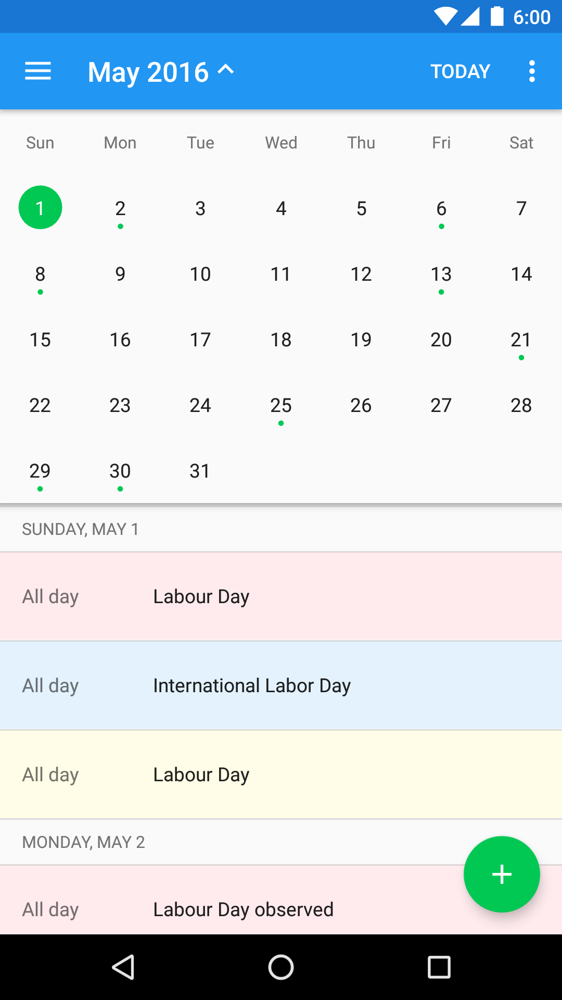

# My Calendar
Simple event calendar, with agenda view.

## Requirements
* Android SDK 23
* Android SDK Tools 25.0.8
* Android SDK Build-tools 23.0.2
* Android Support Library 23.2.1

## Build & Test

**Build**

    ./gradlew :app:assembleDebug

**Test & Coverage**

    ./gradlew :app:lintDebug
    ./gradlew :app:testDebug
    ./gradlew :app:jacocoTestCoverage

## Discussions
Scope and conventions:
* Assume local time zone (device time zone) for UI display
* No recurring events supported
* No attendees information
* Events can span multiple days
* All day events should end at midnight the next day, or any day after that, e.g.:
  * Mon 12:00 AM - Tue 12:00 AM for 1-day event
  * Mon 12:00 AM - Thu 12:AM for multi-day event
* A local calendar will be created if none exists, no functionality to edit or add calendars
* Simple coloring of events based on their calendar ID, from a pool of predefined colors
* Only sync weather for today and tomorrow (from forecast.io)
  * Sync once every 24h
  * Rely on last known location for simplicity
  * Cache using `SharedPreferences` for simplicity

## Screenshots

## Main Repository 
https://github.com/hidroh/calendar

*Weather icons are from Meteocons set by Alessio Atzeni*